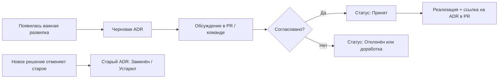

# ADR-0001: Использование Architecture Decision Records

- **Статус:** Принят
- **Дата:** 2026-08-22

## Контекст

Проект растёт: появляются выборы стека, интеграций, структуры данных и подходов к безопасности. Без явной фиксации решения теряются в истории PR, чатах и памяти участников. Новым людям и будущему «мы» сложно понять, *почему* сделано именно так.

Architecture Decision Record (ADR) — короткий документ, который сохраняет контекст, принятое решение и его последствия.

## Решение

**Важные архитектурные и технические решения прокатываем через ADR.**

### Что считается важным решением

Создаём ADR, если решение:

- влияет на архитектуру приложения, данные или инфраструктуру;
- сложно или дорого откатить;
- задаёт convention для всей кодовой базы (фреймворк, ORM, auth, деплой, монорепо и т.п.);
- затрагивает безопасность, персональные данные или compliance;
- выбирает между несколькими существенными альтернативами;
- отказывается от ранее принятого подхода.

ADR **не нужен** для локальных рефакторингов, переименований, мелких багфиксов и очевидных правок в рамках уже принятого решения.

### Где хранить

- Каталог: `docs/adr/`
- Именование: `NNNN-краткое-название-kebab-case.md` (номер с ведущими нулями, slug на английском)
- Индекс и ссылки: `docs/adr/README.md`

### Формат

Используем шаблон из [`template.md`](./template.md):

| Раздел | Содержание |
|--------|------------|
| **Контекст** | Проблема, ограничения, что уже известно |
| **Решение** | Что выбрали |
| **Рассмотренные альтернативы** | Что отвергли и почему |
| **Последствия** | Плюсы, минусы, follow-up задачи |

### Процесс

1. **Черновик** — автор создаёт файл со статусом **Предложен**, заполняет шаблон.
2. **Обсуждение** — PR или явное ревью у заинтересованных; правки вносят в тот же ADR.
3. **Принятие** — после согласования статус **Принят**, запись добавляется в индекс `README.md`.
4. **Реализация** — в PR с кодом по возможности ссылаемся на номер ADR (например, «implements ADR-0003»).
5. **Изменение решения** — не переписываем историю: новый ADR со статусом **Принят**, в старом ставим **Заменён [ADR-XXXX]** или **Устарел** с кратким пояснением.

### Статусы

| Статус | Значение |
|--------|----------|
| **Предложен** | На обсуждении |
| **Принят** | Действует |
| **Отклонён** | Рассмотрели, не приняли |
| **Устарел** | Больше не актуален, замены нет |
| **Заменён** | Ссылка на новый ADR |

### Роли

- **Автор** — тот, кто инициирует решение; готовит ADR.
- **Ревьюеры** — проверяют полноту контекста и альтернатив; не обязательно блокируют мерж, но несогласие фиксируют в обсуждении ADR.
- **Все** — при споре «почему так» сначала смотрим ADR, потом код и историю.

## Рассмотренные альтернативы

- **Только комментарии в коде и PR** — не дают обзора решений и теряются со временем.
- **Один большой ARCHITECTURE.md** — быстро устаревает, сложно версионировать отдельные решения.
- **Wiki / Notion вне репозитория** — не в git-истории рядом с кодом, хуже для code review.

## Последствия

### Плюсы

- Прозрачная история «почему так».
- Меньше повторных споров об уже принятых вещах.
- Онбординг: новый участник читает `docs/adr/README.md`.
- Решения ревьюятся так же, как код (через PR).

### Минусы

- Небольшие затраты времени на оформление.
- Риск формализма ради формализма — смягчаем критерием «важное решение» выше.

### Действия

- [x] Завести каталог `docs/adr/` и шаблон
- [x] Принять этот ADR как базовый процесс
- [x] При следующем значимом решении создать ADR-0002 по шаблону
