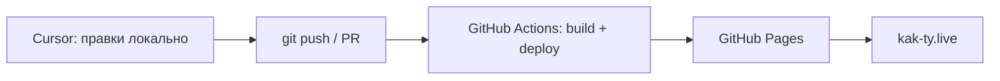

# ADR-0002: Переезд с Lovable на GitHub Pages и Cursor

- **Статус:** Принят
- **Дата:** 2026-08-22

## Контекст

Сайт **kak-ty.live** изначально собран на платформе [Lovable](https://lovable.dev): быстрый прототип, встроенный хостинг, AI-редактор в браузере. Репозиторий синхронизировался с Lovable Cloud.

По мере роста проекта ограничения Lovable-экосистемы стали перевешивать скорость старта:

- код и история изменений должны жить в **нашем** GitHub-репозитории, а не только в платформе;
- нужен полноценный локальный dev-цикл и IDE с AI (Cursor), а не только веб-редактор Lovable;
- хостинг фронтенда — статический SPA на Vite/React — не требует managed-платформы Lovable;
- бэкенд изначально был в **Supabase** — отменено в [ADR-0003](./0003-no-backend-static-site-only.md); сайт полностью статический.

Репозиторий: `polomodovanastya-ship-it/growup-ty`. Продакшен-домен: `https://kak-ty.live`.

## Решение

**Фронтенд переносим с Lovable-хостинга на GitHub Pages. Разработку и доработки сайта ведём в Cursor.**

### Хостинг: GitHub Pages

- Сборка: `vite build` → статика в `dist/`.
- Деплой: GitHub Actions по push в `main` (workflow в `.github/workflows/`).
- Домен `kak-ty.live` указывает на GitHub Pages (CNAME + DNS у регистратора).
- SPA-роутинг: fallback на `index.html` для client-side routes (React Router).

### Разработка: Cursor

- Локально: `bun install` / `npm install`, затем `bun dev` или `npm run dev`.
- Изменения — через git: ветка → PR → merge в `main` → автодеплой.
- AI-помощь и рефакторинг — в Cursor; Lovable-редактор больше не используем как основной инструмент.

### Что остаётся от Lovable (временно)

| Компонент | Статус |
|-----------|--------|
| `lovable-tagger` | **Удалён** |
| `lovable-agent-playwright-config` | **Заменён** на `@playwright/test` |

> Supabase и `@lovable.dev/email-js` удалены вместе с бэкендом — см. [ADR-0003](./0003-no-backend-static-site-only.md).

### Рабочий процесс после переезда

## Рассмотренные альтернативы

- **Остаться на Lovable** — проще на старте, но меньше контроля над git-процессом, IDE и CI; привязка к платформе.
- **Vercel / Netlify / Cloudflare Pages** — хорошие варианты для SPA, но GitHub Pages достаточен для статики, бесплатен для open/private repo и уже в экосистеме GitHub.
- **Продолжать править только в Lovable, GitHub — зеркало** — дублирование процессов, риск расхождения веток; отвергнуто.

## Последствия

### Плюсы

- Полный контроль над репозиторием, CI/CD и доменом.
- Cursor: локальная разработка, агенты, skills, нормальный diff/review.
- GitHub Pages: нулевая стоимость хостинга статики, прозрачный деплой из `main`.
- Меньше vendor lock-in на уровне фронтенда и процесса разработки.

### Минусы

- Нужно самим настроить и поддерживать GitHub Actions, DNS, SPA-fallback.
- Lovable «из коробки» больше не даёт one-click deploy и встроенный AI-редактор — это сознательный trade-off.

### Действия

- [x] Код в GitHub (`polomodovanastya-ship-it/growup-ty`)
- [x] Локальная разработка через Vite; основной инструмент — Cursor
- [x] GitHub Actions workflow для деплоя на Pages (`.github/workflows/deploy-pages.yml`)
- [x] `public/CNAME` для `kak-ty.live`
- [x] `base: "/"` в Vite (custom domain на корне)
- [x] SPA 404 → `index.html` (`postbuild`: копия в `dist/404.html`)
- [x] Убран `lovable-tagger`
- [x] Playwright config без Lovable
- [x] `.env.example`, инструкция деплоя (`docs/DEPLOY.md`)
- [x] DNS у регистратора → GitHub Pages (`kak-ty.live` отвечает)
- [x] GitHub Pages: Source = GitHub Actions (GitHub Pro)

> Supabase и GitHub Secrets для него — отменены [ADR-0003](./0003-no-backend-static-site-only.md).
